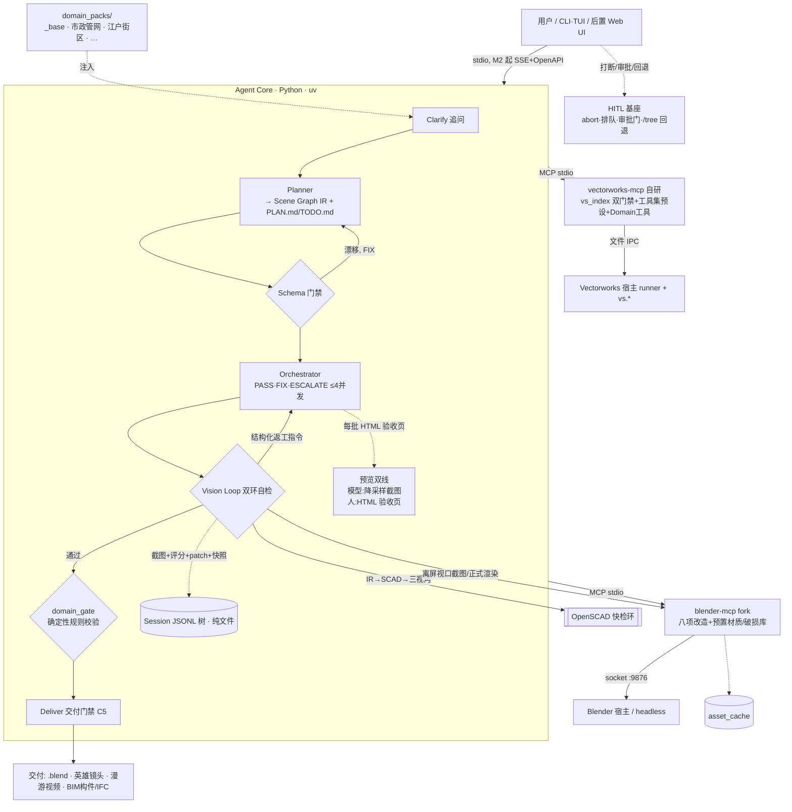

# openBIMAgent 总体架构

版本:v0.5.0(Subagent Runtime v1 P1e 单机 IPC)· 2026-08-01
依据:`docs/research/01-11` 全部调研与评审 · 决议:`docs/architecture/DECISIONS_DRAFT.md`
姊妹篇:[COMPONENTS.md](COMPONENTS.md)(组件/agent/模型配置/上下文管理详设)

## 0. 设计原则

1. **质量优先**,时间与 credit 不是约束;token 效率靠架构省(双环分工、子代理并行、接力开发)。
2. **Agent + 两个 MCP**,除此之外不做第三种集成方式;两 MCP 是**并行生成路径**,不是表现/交付分层。
3. 继承铁律 **C2**(LLM 出语义、Solver 出坐标)与 **C5**(deliver 只接 accepted 产物)。
4. **极简内核**:loop + ≤8 工具,plan/todo/记忆外置成文件;不用 LangGraph/CrewAI/AutoGen。
5. **工具结果双视图**(LLM 视图 / UI 视图分离),渲染层永不打补丁。
6. **一切留痕**:session JSONL 树,截图、评分、patch、工具调用全落盘,可回放。
7. **Domain Pack 垂直化**:通用基座 + 领域专家包;江户包是**模板范例**,不是唯一版本(模板族见 §4)。
8. **工件即协议**:模型间只经工件文件交接,且工件过 **Schema 门禁**。
9. **人在环上(HITL)**:用户可随时打断、回退、审批;基座能力见 §6.5,不是可选项。
10. **能机器校验的不交给模型**:确定性规则走 domain_gate,VLM 只评外观/语义/布局。

## 1. 总体架构图



## 2. 一次任务的完整生命周期

1. **Clarify(追问)**:读包内 playbook 的 `slots:`,CLI 一问一答(带默认值,回车即接受),答齐确认单放行。全程可打断/改答。
2. **Plan**:实例化 `PLAN.md` + `TODO.md` + **Scene Graph IR**(只出语义,C2)。
3. **Schema 门禁**:工件过 JSON Schema,漂移即 FIX。
4. **Research**:产出 `references.md`;资产进 `asset_cache`(hash + 429 退避)。
5. **逐资产建模**:SCAD 快检挡结构错误 → MCP 精建(只调预置库/包内 tools)→ 精检环渲染评分 → 不通过给可执行返工指令 → 回滚点 = 该批前快照。**每批产出 HTML 验收页给人看**。
6. **灯光渲染**:统一色调、氛围、英雄机位、相机轨迹。
7. **domain_gate + Deliver**:确定性规则机器校验 → 交付清单(C5)→ **人审签**。
8. 全程 trace;任意时刻用户可 abort(部分结果保留)、排队新消息、/tree 回退重跑。

## 3. 双环视觉自检 + 评分分层(来源 03/10 报告)

### 评分分层(原则 10)

- **确定性维**(碰撞、坡度、净距、管径序列、尺寸容差):走 `domain_gate` 机器校验(constraints.yaml 驱动),**不过 VLM**,结果二元 pass/fail。
- **软评分维**(外观/风格/材质/磨损/灯光/构图):走 VLM critic 六维 rubric。

### 环 1 · SCAD 结构快检环

IR → OpenSCAD 三视角白模 → critic 评**几何正确性 + 基础构图**两维 → JSON patch → 收敛四选一 + best-so-far(ADR-0004)。毫秒级,挡结构错误于 Blender 之外。

### 环 2 · Blender 美学精检环

每批 → 离屏视口截图(自检,**非黑断言**)+ 正式渲染(验收)→ critic 全维评分 → 返工指令 → 复评。六维与 0/5/10 锚点:

| 维度 | 锚点 0 / 5 / 10 |
|---|---|
| 几何正确性 | 严重漂浮 / 轻微重叠 / 遵循物理空间 |
| 风格一致性 | 出戏 / 元素堆砌 / 浑然天成 |
| 材质真实感 | 纯色 / 低分重复 / PBR 真实 |
| 经年磨损破损 | 一尘不染 / 均匀噪声脏 / 自然水渍磕碰边缘磨损 |
| 灯光氛围 | 全白无影 / 有光死板 / 体积光层次 GI |
| 镜头构图 | 遮挡跑焦 / 居中平庸 / 前景遮挡英雄机位 |

### 防放水五件套(社区证据 10 报告 §3)

1. **A/B swap 两两比较**(与上一版快照对比,交换顺序防位置偏置)。
2. **<8 分强制 `actionable_rework_command`**,禁空泛建议。
3. **锚点图对齐** + 落盘 `anchor_ref`;critic 强制 CoT(`reasoning`)。
4. **关键维 pass/fail 硬门禁不进平均**(碰撞/净高/连通等,与 domain_gate 呼应)。
5. **judge 与生成模型分家**(禁同会话自我打高分);Domain Pack 附**黄金截图集**,版本升级先跑 judge 校准回归。

## 4. Domain Pack 与模板族

包结构:

```
domain_packs/<name>/
├── playbook.md          # 流程剧本(slots/phases/acceptance/deliverables)
├── agents/              # 领域角色覆盖(可选)
├── knowledge/           # 领域知识/规范/坑清单(如 constraints.yaml)
├── tools/               # 已验证领域工具(避让算法/GeoNodes 挂载器…)——优先于裸 execute_code
├── assets/              # 材质板、GeoNodes 预设、typology 模板、黄金截图集
├── rubric_overlay.md    # 领域评分叠加 + 确定性 domain_gate 规则引用
└── benchmark_cases.json # 领域评测用例
```

**模板族**(`domain_packs/_base/` 有创作指南):五条硬性要求(调研先行/分资产/统一色调+磨损/子代理分工/每批渲染返工)为**通用核心**,所有包继承。三类范例:风格场景类(`edo_cyberpunk_district`)/ BIM 交付类(`municipal_utility`)/ 冒烟类(`single_asset_hero`)。**两 MCP 并行生成路径**:`targets` 按包选用,可单用可并用;Blender 经 Bonsai 出 IFC 列为 M2 评估。远程拉取(Goose 式)P1。

## 5. 两个 MCP 的规格(定稿)

### blender-mcp(fork ahujasid,基座=官方最新验证稳定版)

宿主实测:**Blender 5.2.0 LTS**(`D:\devloop\blender`,2026-07-14 build)——上游主要验证于 4.x,**5.x 兼容是 M0 第一个 spike**。

改造八项(社区五大坑对应,见 10 报告):

1. **遥测硬关**;2. **headless 放开**;3. **快照 + AST allowlist**;4. **工具精简 ≤12** + 新增 `batch_render`/`camera_turntable`/`camera_path_render`;
5. **连接健康检查**:启动探针 + 首包重试 + 超时切片;6. **截图非黑断言**:离屏 GPUOffScreen 固化,黑图自动重采/报错;7. **范围锁**:可编辑集合白名单,禁止触碰集合外对象;8. **预置库**:procedural 材质库(Infinigen 金标准)+ Damage GeoNodes 修改器——LLM 只调参数。

**能力披露(协议+自建)**:MCP `initialize` 握手自带 serverInfo(name/version,协议白给,不用用户操心);工具级信息自建 `describe_capabilities` 工具——返回 server 版本、宿主 Blender 版本、工具集清单、限制、已知坑;**agent 开工先调它对齐**。

### vectorworks-mcp(自研,借鉴 blender-mcp 两段式 + 自身增强)

宿主:**Vectorworks 2024**(`D:\devloop\VectorWorks 24`;vs API 差异以 2024 为准,vicquick 的 2026 坑清单仅作参照)。

1. **三层划分**(Trigger→Executor→Work);M1 用 Python runner + 文件 IPC,C++ palette 延后。
2. **handoff/hash/approval 植入 Executor**。
3. **`vs_index.json` 双门禁**:arity 校验防崩溃 + 函数名白名单防幻觉(社区共识:LLM 编造 vs 函数)。
4. **工具集预设**(248→40~100);**Domain 工具封装优先**,`run_script` 逃生门兜底且走审批。
5. **AGENTS.md 坑清单** + 官方文档/示例 RAG(渐进披露)。
6. **能力披露**:同款 `describe_capabilities`(server 版本/VW 宿主版本/工具集/限制/坑)。

## 6. 子代理、trace 与事件协议

- 子代理 = Markdown + YAML frontmatter;禁嵌套;并发 ≤4;child session;返回 = 摘要 + 工件路径 + <200 字核心提示。
- **Subagent Runtime v1(P0 + P1a + P1b-A + P1b-B Approval + P1c Resume/Steer + P1d Control Plane 已接通)**:版本化 `SubagentRequest/SubagentHandle/SubagentResultEnvelope` + JSON Schema;模型只可请求 `role/task/context_mode/execution_mode/artifact_contract`,实际 model/tools/permissions 由受信任角色 profile 决定。`LocalSubagentRuntime` 每次创建真实 child Session,将 summary/output 复制到不可变运行目录,生成含 size/SHA-256 的 `ArtifactManifest`,父 Session 只接收紧凑结果与工件指针。
- P1a 已实现进程内 `background → status/cancel/join`,线程池并发硬上限 4。取消使用协作式 `threading.Event`,贯穿默认 child `AgentLoop` 和 Provider 流式调用;只有 Manifest、终态 lifecycle 与 receipt 全部完成后才暴露终态。
- P1b-A 将 background 可变状态原子写入 `sessions/_runtime/<request_id>.json`。启动时：终态直接恢复且不重跑模型；`finalizing` 幂等补齐 lifecycle/receipt；遗留 `prepared/running` 以 `RuntimeRestarted(retryable=true)` 失败关闭，避免重复副作用；损坏状态文件严格失败并报告路径。
- P1b-B Approval Broker 将 child 的 `Permission.ASK` 记录为版本化 `ApprovalRequest`，同时投递父/子 Session；父侧可使用兼容旧接口的 bool callback，或调用 `pending_approvals()/decide_approval()` 异步决策。`DecisionReceipt` 支持 approved/rejected/cancelled/timed_out/runtime_restarted、同决策幂等和冲突拒绝。Session 仅保存参数字段类型摘要及 canonical SHA-256，不保存 code/content/token 等原始值。
- 同一 `sessions` 目录由进程生命周期 `RuntimeLease` 独占，取得 lease 后才允许 rehydrate；第二个活跃 Runtime 立即失败，崩溃后锁由 OS 释放。`sessions/index.json` 使用进程内共享 `RLock` + Windows `msvcrt`/POSIX `flock` 跨进程锁，并以 `fsync + os.replace` 原子更新。审批恢复会对账父/子 Session：任一侧已有合法 decision receipt 时复用并补齐另一侧；均未决才失败关闭为 `runtime_restarted`；冲突事实严格失败。
- P1c 将单次运行明确为 attempt：`request_id` 只代表一个 attempt，逻辑任务由 `lineage_id` 关联，`attempt_number` 单调递增。`resume` 新建 request/agent/child，不复制旧 child tool-call 事件，不自动重跑旧工具；旧结果只以终态摘要、不可变 Artifact 路径与 SHA-256 作为只读上下文，并要求新 attempt 先检查当前外部状态。
- `steer` 仅接受 queued/running attempt，并绑定 request/agent/child/lineage/attempt 五重身份；内存队列只服务当前 Runtime，在 `AgentLoop` 下一轮 Provider 调用前的安全边界消费。它不打断正在进行的 Provider 请求，不插入同一工具批次，也不能绕过 Approval Broker。终态、取消、身份不匹配或 Runtime 重启均签发明确回执，历史 accepted steer 不重入队、不串入 resume attempt。
- P1d 将 `requested_by/decided_by` 升级为版本化 `ActorRef(actor_id, actor_type, display_name)`；历史字符串 actor 在读取时规范化为 `legacy`，新写入使用稳定身份。Resume 增加 `instruction_sha256 + idempotency_key`，幂等域是 `actor_id + idempotency_key`：同语义重试复用原 Handle/Receipt，不同 source 或指令哈希严格冲突，重启后从 RuntimeState 恢复同一事实。
- P1d `ReadOnlyControlPlane` 只投影 `sessions/_runtime/*.json` 与父/子 Session 审计事实，提供 attempts/lineage/approvals/resumes/steers 查询；默认不暴露 task/instruction 原文。`control` CLI 支持文本和 JSON 输出，可与活跃 Runtime 并行读取且不获取 lease。
- P1e 增加 `RuntimeIpcServer/RuntimeIpcClient` 和 `runtime-serve/control-write` CLI。服务绑定唯一 Runtime lease owner，仅监听 `127.0.0.1`，使用 `sessions/_runtime/control-ipc.json` discovery 与独立 token 文件；请求/响应为版本化单行 JSON，消息大小、超时、ActorType、payload 字段和 message_id 均严格校验。Approval/Resume/Steer/Cancel 由服务路由到内存 Runtime，客户端不能自行重建 Runtime；IPC 写操作按 `actor_id + idempotency_key` 幂等，冲突失败，bearer token 不进入 Session/RuntimeState/日志。
- v1 生命周期用 custom 事件记录 `subagent_created/started/completed/failed/cancelled`、`artifact_committed`、`delivery_receipt`、`approval_requested/approval_decided`、`resume_requested/resume_receipt`、`steer_requested/steer_receipt`;父子关系及 attempt lineage 写入 `sessions/index.json.child_of`。Resume/Steer 控制事件支持幂等补写和父子/三方对账，冲突事实严格失败。
- trace = pi JSONL 树 + OTel `gen_ai.*` 对齐 + custom 事件(screenshot/score/patch/snapshot/subagent lifecycle/artifact/receipt)+ VLM 留痕(reasoning/anchor_ref/actionable_feedback);纯文件,不接 Langfuse。
- SSE(M0 定 schema,M2 实现):全走 `data-*` parts;双视图(tool-result 给 LLM 文本,data 流给 UI 素材)。

### 6.5 HITL 基座与预览双线(M0 必备)

**基座能力**(用户硬性要求;交互风格参考 **Codex CLI**):

| 能力 | 实现 |
|---|---|
| 打断 abort | providers 层全程可 abort 且返回部分结果;orchestrator 落 checkpoint |
| 消息排队 | 打断期间用户消息入队,当前批结束后处理 |
| 审批门 | 权限三态 ask 落在:MCP 写操作 / execute_*_code / deliver |
| 回退 | session `/tree` 选父节点 + 快照恢复(.blend/IR);`/undo` `/redo` |
| 断点续跑 | 状态全外置,重启 = 重读文件 + 树定位 |
| doom_loop | 同资产 N 次 FIX 无进展 → ESCALATE 问人 |
| **多会话/侧边栏** | 每会话一个 JSONL,存储天然支持;会话列表/命名/跳转,TUI 侧边栏实现(Web UI 同构)——用户指定喜欢 |
| **斜杠命令集** | `/compact`(手动压缩) `/tree` `/fork` `/undo` `/redo` `/retry` `/sessions` `/model` `/diff` `/export` |
| **上下文压缩** | 阈值自动压缩(compaction 子代理,有损摘要)+ `/compact` 手动;全史永留 JSONL 可溯 |

**预览双线**:

- **给模型看**:SCAD 白模三视角 + Blender 离屏视口截图 + 正式渲染,一律降采样进上下文,原图落盘。
- **给人看**:每批自动生成 **HTML 验收页**(contact sheet:当批截图 + 六维评分 + 与上版对比 + 返工指令),落 session artifacts,CLI 打印路径;资产级 turntable 序列帧;M2 后 Web UI 实时化。UI 规划总量:CLI/TUI(M0)+ Web UI(M2)+ Blender addon 状态面板(fork 自带)+ VW palette(延后)。

## 7. 与 openBIMForge 的资产映射

见 01 报告 §3。要点:视觉环/VW 执行链/Blender 实验安全层移植;orchestrator/trace/澄清参考重写;`mep_agent` → 市政管网包 knowledge 与保底模板;知识资产(`typologies`/`example_library`/`component_patterns`/`prompt_library`)→ 知识库四层(见 COMPONENTS §1);**任务模式吸收结论:MEP → 市政管网包(已);ForgeVision-Form / Layout → 模板族后续类型(P2,与 GenCAD 图生 CAD 呼应)**;v2 与前端弃。

## 8. 风险与对策

| 风险 | 对策 |
|---|---|
| VW 必须宿主 | 协议层 mock + 真机手动验收 |
| **Blender 5.x 与上游 fork 不兼容** | M0 第一个 spike 验证;不兼容则 pin 可工作提交自行移植 |
| VLM 放水/飘移 | 防放水五件套 + 评分分层(§3) |
| 工件漂移 | Schema 门禁 |
| MCP 工具吃 context | 工具集预设 + ≤12 + 渐进披露 |
| execute_*_code 风险 + Agent 越界 | AST allowlist + 快照 + 范围锁 + 审批 |
| LLM 编造 vs 函数 | vs_index 白名单双门禁 + Domain 工具封装 |
| blender-mcp 连接/截图不可靠 | 健康检查 + 非黑断言 + 超时切片 |
| 资产源 429 | asset_cache + 指数退避 |
| 设计院不信任 | 检核表叙事 + 人审签 + 每条约束可引规范 |
| **联调 key 额度低(agentrouter)** | profile 切换:test 通道 glm-5.2 扛高频、opus-4-8 只在质量咽喉;正式跑批切官方通道 |

## 9. 里程碑

- **M0 原型(本次审核)**:core 骨架 + session JSONL + Schema 门禁 + **HITL 基座全项** + blender-mcp fork 八项改造(Blender 5.2 spike 先行)+ SCAD 环 + `_base`/`江户`/`单资产` 包 → 单资产端到端 + 每批 HTML 验收页。
- **M1**:Blender 精检环全维 + 防放水五件套 + vectorworks-mcp 拆分 + 预置库 + asset_cache + orchestrator 并发。
- **M1.5(毕设线)**:市政管网包(constraints 二轮核实 + VW 构件 + domain_gate + Blender 剖切漫游)+ 领域评测。
- **M2**:server/SSE + CLI/TUI(含会话侧边栏);远程 playbook;Web UI 技术验证;Bonsai 路径评估。
- **M3**:trace 评测导出 + BIMBench 对接(论文按需)。
