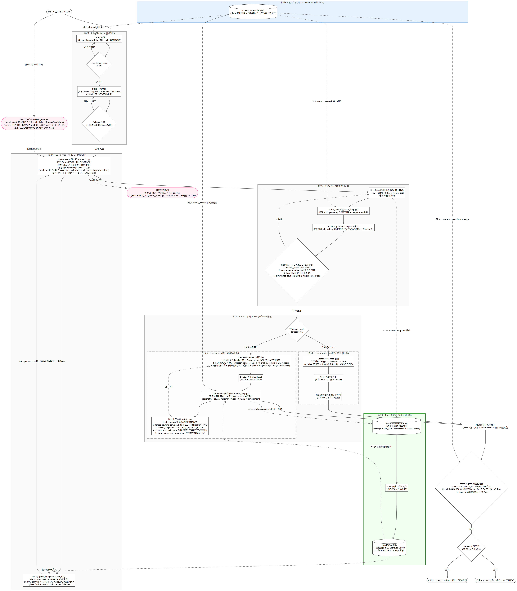

# openBIMAgent 全景架构图 (v2.0 - 源码精简透视版)

> **注**：本架构图依据 `src/openbimagent/` 源码（`loop.py`, `dispatch.py`, `scad_loop.py`, `rubric.py`, `constraints.yaml`）及权威设计文档全量重构绘制。适用于学术专刊投稿（如《软件学报》2026 专刊“面向智能体信息系统的软件新技术”）。支持 Mermaid 渲染的 Markdown 编辑器可查看。

![[openBIMAgent_Architecture_Graph.png]]

> 📎 **矢量图下载/预览**：[openBIMAgent_Architecture_Graph.svg](openBIMAgent_Architecture_Graph.svg)

```mermaid
flowchart TD
  %% ===== 外部交互层 =====
  U(["用户 / CLI·TUI / Web UI"])

  %% ===== 模块 1: 意图层 =====
  subgraph M1 ["模块1 · 追问 Clarify (意图契约化)"]
    direction TB
    CLA["Clarify 追问<br/>(读 domain pack slots / CLI 一问一答带默认值)"]
    CONF{"completion_score<br/>≥ 85?"}
    PLN["Planner 规划器<br/>产出: Scene Graph IR + PLAN.md / TODO.md<br/>(C2铁律: 只出语义不出坐标)"]
    GATE{"Schema 门禁<br/>(工件过 JSON Schema 校验)"}
    
    CLA --> CONF
    CONF -->|否 补全槽位| CLA
    CONF -->|是 放行| PLN
    PLN --> GATE
    GATE -.->|漂移 FIX 返工| PLN
  end
  U --> CLA

  %% ===== 模块 2: Agent 底座层 =====
  subgraph M2 ["模块2 · Agent 底座 + 多 Agent 并行编排"]
    direction TB
    ORC["Orchestrator 调度器 (dispatch.py)<br/>裁决: Verdict(PASS / FIX / ESCALATE)<br/>约束: 并发 ≤4 | 禁嵌套 (非0深度拒)<br/>极简内核 AgentLoop: loop + 8 工具<br/>(read / write / edit / bash / mcp_call / vision_check / subagent / deliver)<br/>预算: system_prompt + tools 小于 2000 tokens"]
    
    AGENTS["9 个领域子代理 (agents/*.md 定义)<br/>(Markdown + YAML frontmatter 角色定义)<br/>clarify / planner / researcher / modeler / materialist<br/>lighter / critic_scad / critic_render / deliver"]
    
    ORC -->|派发任务| AGENTS
    AGENTS -->|SubagentResult 交接: 摘要+路径+提示| ORC
  end
  GATE -->|通过 PASS| ORC

  %% ===== 模块 3: SCAD 视觉纠错 (环 1) =====
  subgraph M3 ["模块3 · SCAD 视觉结构纠错 (环1)"]
    direction TB
    SCAD["IR → OpenSCAD 代码 (确定性无LLM)<br/>→ CLI 三视角白模 (iso / front / top)<br/>(毫秒级渲染成本)"]
    CRIT1["critic_scad 评估 (scad_loop.py)<br/>(只评 2 维: geometry 几何正确性 + composition 构图)"]
    PATCH["apply_ir_patch (JSON patch 修复)<br/>(严格校验 old_value; 错则整批拒绝; 拦截结构错误于 Blender 外)"]
    CONV1{"收敛四选一 (TERMINATE_REASONS)<br/>1. perfect_score: 评分 ≥ 0.95<br/>2. convergence_delta: Δ 小于 0.5 停滞<br/>3. hard_limit: 达到上限 5 轮<br/>4. divergence_fallback: 连降 2 轮回退 best_ir.json"}
    
    SCAD --> CRIT1
    CRIT1 --> PATCH
    PATCH --> CONV1
    CONV1 -.->|未收敛| SCAD
  end
  ORC --> SCAD

  %% ===== 模块 4: MCP 工具与 BIM 输出层 (双路径并行) =====
  subgraph M4 ["模块4 · MCP 工具输出 BIM (两条分支并行)"]
    direction LR
    SPLIT{"按 domain pack<br/>targets 分流"}
    
    subgraph M4_A ["分支A · blender-mcp 路径 (视觉/场景类)"]
        direction TB
        BLM["blender-mcp fork (8项改造)<br/>1.遥测硬关 2.headless放开 3.save_as_mainfile快照+AST白名单<br/>4.工具精简≤12 + 3新工具(batch_render/camera_turntable/camera_path_render)<br/>5.连接健康检查 6.截图非黑断言 7.范围锁 8.预置 Infinigen 材质+Damage GeoNodes库"]
        BLH["Blender 宿主 (headless)<br/>(socket localhost:9876)"]
        VIS2["环2 Blender 美学精检 (render_loop.py)<br/>离屏截图非黑断言 + 正式渲染 → VLM 6 维评分<br/>(geometry / style / material / wear / lighting / composition)"]
        ANTI["防放水五件套 (rubric.py)<br/>1. ab_swap: A/B 两两比较防位置偏置<br/>2. forced_rework_command: 低于 8.0 分强制量化返工指令<br/>3. anchor_alignment: 0/5/10 锚点图对齐 + 强制 CoT<br/>4. critical_pass_fail_gate: 碰撞/净高/连通硬门禁(不平摊)<br/>5. judge_generator_separation: 评估与生成模型分家"]
        
        BLM --> BLH
        BLH --> VIS2
        VIS2 --> ANTI
        ANTI -.->|返工 FIX| BLM
    end

    subgraph M4_B ["分支B · vectorworks-mcp 路径 (BIM 构件类)"]
        direction TB
        VWM["vectorworks-mcp 自研<br/>三层划分: Trigger → Executor → Work<br/>vs_index 双门禁: arity 参数个数校验 + 函数名白名单"]
        VWH["Vectorworks 宿主<br/>(文件 IPC + vs.* 脚本 runner)"]
        NO_LOOP["输出精确 BIM 构件/工程图<br/>(结构确定, 不走环2视觉)"]
        
        VWM --> VWH
        VWH --> NO_LOOP
    end
    
    SPLIT -->|分支A 场景美学| BLM
    SPLIT -->|分支B 构件尺寸| VWM
  end
  CONV1 -->|结构通过| SPLIT

  %% ===== 质检与交付管道 =====
  LIGHT["灯光渲染与机位编排<br/>(统一色调 / 英雄机位 hero shot / 相机轨迹漫游)"]
  VIS2 -->|通过| LIGHT
  NO_LOOP --> LIGHT
  
  DGATE{"domain_gate 确定性校验<br/>(constraints.yaml 驱动: 25条国标级硬约束<br/>例: MU-DRAIN-001 最小管径300mm / MU-ELEV-001 覆土≥0.7m)<br/>二元 pass/fail (机器直验, 不过 VLM)"}
  LIGHT --> DGATE
  
  DLV{"Deliver 交付门禁<br/>(C5 节点: 人工审签)"}
  DGATE -->|通过| DLV
  
  OUTA(["产出A: .blend / 英雄镜头照片 / 漫游视频"])
  OUTB(["产出B: IFC4x3 实体 / 构件 / 2D 工程图纸"])
  DLV -->|签发| OUTA
  DLV -->|签发| OUTB

  %% ===== 模块 5: Trace 自进化层 (横切) =====
  subgraph M5 ["模块5 · Trace 自进化 (横切数据飞轮)"]
    direction TB
    TRC[("SessionStore (store.py)<br/>JSONL 树存储 (5类事件:<br/>message / tool_call / screenshot / score / patch)")]
    REPLAY["trace 回放与模式复盘<br/>(分析成功 / 失败轨迹)"]
    LIB[("沉淀四层示例库<br/>1. 黄金截图集  2. approved 资产库<br/>3. 成功代码片段 4. prompt 模板")]
    
    TRC --> REPLAY
    REPLAY --> LIB
  end

  %% ===== 模块 6: 领域专家切换层 (横切) =====
  subgraph M6 ["模块6 · 领域专家切换 Domain Pack (横切注入)"]
    direction TB
    PACKS[("domain_packs/ 动态注入<br/>(_base 通用基座 / 市政管网 / 江户街区 / 单资产)")]
  end

  %% ===== 依赖注入与反馈路线 =====
  PACKS -.->|注入 playbook和slots| CLA
  PACKS -.->|注入 constraints.yaml和knowledge| DGATE
  PACKS -.->|注入 rubric_overlay和黄金截图| CRIT1
  PACKS -.->|注入 rubric_overlay和黄金截图| VIS2
  
  LIB -.->|提示词优化注入| AGENTS
  LIB -.->|judge 校准与回归测试| VIS2

  %% ===== 旁路支持: HITL 与 双线预览 =====
  HITL(["HITL 打断与交互基座 (loop.py)<br/>cancel_event 置位打断 / 消息队列 / 权限三态(deny/ask/allow)<br/>/tree 会话树回退 + 快照恢复 / DOOM_LOOP_MAX_FIX=3 升级问人<br/>上下文压缩与预算管理 (budget 小于 2000)"])
  PREV(["预览双线机制<br/>模型端: 降采样截图 (入上下文 budget)<br/>人类端: HTML 验收页 (html_report.py: contact sheet / 6维评分 / 比对)"])
  
  U -.->|随时打断 审批 回退| HITL
  HITL -.->|状态控制与恢复| ORC
  ORC -.->|流式输出界面| PREV
  SCAD -.->|screenshot/score/patch 落盘| TRC
  VIS2 -.->|screenshot/score/patch 落盘| TRC

  %% ===== 节点样式控制 =====
  classDef default fill:#ffffff,stroke:#333333,stroke-width:1px;
  classDef module fill:#fafafa,stroke:#444444,stroke-width:2px;
  classDef sub_branch fill:#fdfdfd,stroke:#888888,stroke-width:1.5px,stroke-dasharray: 4 2;
  classDef injection fill:#e6f3ff,stroke:#0066cc,stroke-width:2px;
  classDef trace fill:#f0fff0,stroke:#228b22,stroke-width:2px;
  classDef bypass fill:#fff0f5,stroke:#ff69b4,stroke-width:2px;
  
  class M1,M2,M3,M4 module;
  class M4_A,M4_B sub_branch;
  class M6 injection;
  class M5 trace;
  class HITL,PREV bypass;
```

